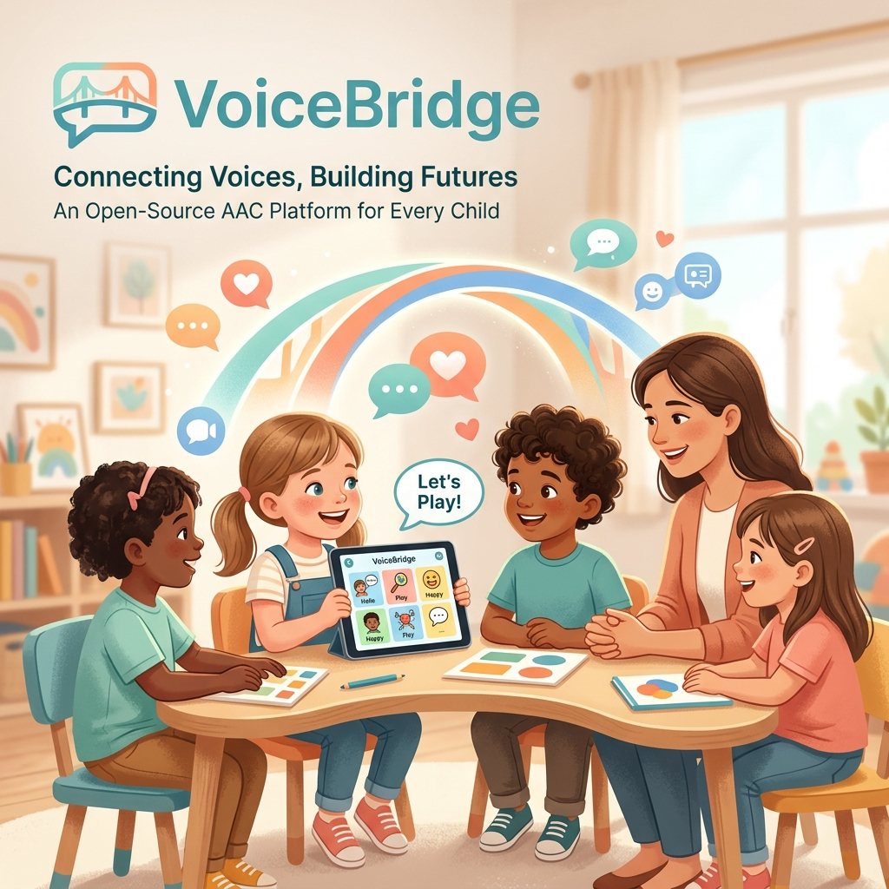

# VoiceBridge



The project was motivated by my personal experience supporting a niece with autism and several years of research in this domain. It directly addresses the gap left by costly, English-only, iOS-exclusive AAC tools that remain out of reach for most families in Bangladesh and other low-resource regions.

Why it matters: AAC tools like Proloquo2Go cost ~USD 249, run only on iPad, and assume English. VoiceBridge is free, Android-first, Bangla-ready, and works without internet.

## ✨ Features
### 🪷 Caregiver Web Portal (React)
- **Sanctuary dashboard** — communication-progress clarity ring, daily insights, active boards at a glance, and a mindful Care Journal.
- **Three-panel Board Editor** — drag-and-drop icon library, live canvas, and an item-properties panel (Canva-style).
- **Custom Asset Creator** — upload a photo and record up to 10 seconds of mother-tongue audio, with a real-time live preview of the card.
- **Asset Library** — bulk drag-and-drop uploads of images and audio with per-asset usage tracking ("used in 3 boards").
- **Community Hub** — browse, filter, and one-click-clone vetted board templates shared by other caregivers.
- **Version History** — every save is snapshotted; review and restore any previous board state (non-destructively).
- **Children profiles** — manage a separate board set for each non-verbal individual you support.
- **Fully responsive** — works on desktop and collapses to a mobile drawer on phones.

### 📱 Child's Tablet App (Android, Java)
- **Zero-latency playback** — a custom SoundPool-based audio engine starts speech effectively instantly (critical for motor-association in AAC), with TTS fallback.
- **PECS-style sentence strip** — the child taps icons to compose a phrase, then taps Speak to play the sequence aloud.
- **Offline-first** — after the first sync, the app works with no internet via a local Room (SQLite) database and locally-cached media.
- **Background sync** — WorkManager refreshes boards hourly under network-aware constraints; manual sync is always available.
- **Kiosk mode** — screen pinning prevents accidental exits; a caregiver gesture unlocks it.
- **Immersive full-screen** — distraction-free landscape board for the child.

### 🔒 Backend & Security (Django REST Framework)
- JWT authentication with refresh-token rotation (SimpleJWT).
- Owner-scoped queries — every request is filtered by the requesting caregiver, enforced through the ORM (no raw SQL, parameter-bound by design).
- Audit log — every create/update/delete is recorded (who, what, when, from which IP) via middleware.
- Throttling, CORS, and HSTS hardening.
- Auto-generated OpenAPI / Swagger docs via drf-spectacular. 

## 🏗️ Architecture
```
┌────────────────────┐         ┌────────────────────┐
│  Caregiver Browser │         │    Child Tablet    │
│  React + Tailwind  │         │  Android · Room    │
│  (Web Audio)       │         │  SoundPool engine  │
└─────────┬──────────┘         └─────────┬──────────┘
          │  HTTPS / JWT                 │  incremental sync · media download
          ▼                              ▼
        ┌──────────────────────────────────────┐
        │          Django REST API             │
        │  /api/v1/{auth, boards, icons,       │
        │           community, journal, sync}  │
        └───────────┬──────────────┬───────────┘
                    │ Django ORM   │ media (image / audio)
                    ▼              ▼
            ┌──────────────┐  ┌──────────────┐
            │  PostgreSQL  │  │  /media/      │
            │  (source of  │  │  (S3-ready)   │
            │   truth)     │  │               │
            └──────────────┘  └──────────────┘
```
All caregiver edits flow through PostgreSQL via the Django ORM. The child's tablet pulls boards on demand, caches them in Room, and downloads media to local storage — so the board works without a connection after the first sync.

## 🧱 Data Model
| Model | App | Purpose |
|-------|-----|---------|
| Caregiver | accounts | Custom user (extends AbstractUser); root of all owner-scoped data |
| Child | accounts | A non-verbal individual's profile under a caregiver |
| Icon | icons | An image + audio pair — the atomic unit of communication |
| Board | boards | A grid of icons (rows × cols) for a child |
| BoardItem | boards | Placement of one icon on one board cell (through-table) |
| BoardVersion | boards | Auto-saved snapshot of a board for restore/history |
| Template | community | Shareable board layout with moderation status |
| AuditLog | accounts | Record of every mutating API request |
| CareNote | accounts | A caregiver's mindful Care Journal reflection |

Relationships use `on_delete=CASCADE` so deleting a caregiver atomically removes their children, icons, boards, and versions — no orphan rows.

## 🛠️ Tech Stack
| Layer | Technologies |
|-------|--------------|
| Backend | Django 5, Django REST Framework, SimpleJWT, PostgreSQL, drf-spectacular, Gunicorn, WhiteNoise |
| Frontend | React 18, React Router, Tailwind CSS, Axios (JWT refresh interceptor), MediaRecorder API |
| Mobile | Native Android (Java), Room, Retrofit + OkHttp, SoundPool, TextToSpeech, Glide, WorkManager |
| Build Tools | Gradle, npm, pip |
| Tooling | Git + GitHub, PyCharm Professional, IntelliJ IDEA Ultimate, Android Studio |
| Hardware & Testing | Samsung Galaxy S25, MSI Thin 15 |

## 📂 Repository Structure
```
voicebridge/
├── backend/                 # Django REST API
│   ├── accounts/            # Caregiver, Child, AuditLog, CareNote
│   ├── icons/               # Icon library (image + audio assets)
│   ├── boards/              # Board, BoardItem, BoardVersion + sync
│   ├── community/           # Shared Template hub
│   └── core/                # settings, audit middleware
├── frontend/                # React caregiver portal
│   └── src/
│       ├── pages/           # Dashboard, BoardEditor, Community, …
│       ├── components/      # Layout, Toaster, …
│       └── api/             # axios client + endpoints
├── mobile/                  # Android tablet app (Java)
│   └── app/src/main/java/com/voicebridge/
│       ├── ui/              # SentenceStrip, KioskManager
│       ├── utils/           # AudioPlayer (SoundPool)
│       └── sync/            # PeriodicSyncWorker
└── docs/                    # Architecture, design references
```

## 🚀 Getting Started

### Prerequisites
- Python 3.11+ and PostgreSQL 14+
- Node.js 18+ and npm
- Android Studio (for the mobile app)

### 1. Backend
```bash
cd backend
python -m venv .venv
source .venv/bin/activate          # Windows: .venv\Scripts\activate
pip install -r requirements.txt

# Create the database in PostgreSQL
#   CREATE DATABASE voicebridge_db;
#   CREATE USER voicebridge_user WITH PASSWORD '<your-password>';
#   GRANT ALL PRIVILEGES ON DATABASE voicebridge_db TO voicebridge_user;

cp .env.example .env               # then set SECRET_KEY and DB_PASSWORD
python manage.py migrate
python manage.py createsuperuser
python manage.py runserver         # http://localhost:8000
```
API docs available at `http://localhost:8000/api/schema/swagger-ui/`.

### 2. Frontend
```bash
cd frontend
npm install
npm start                          # http://localhost:3000
```

### 3. Mobile (Android)
Open the `mobile/` folder in Android Studio, let Gradle sync, then run on an emulator (server URL `http://10.0.2.2:8000/`) or a tablet on the same Wi-Fi.

## 🔌 API Overview
| Endpoint | Methods | Description |
|----------|---------|-------------|
| `/api/v1/auth/` | POST | Obtain / refresh JWT tokens |
| `/api/v1/children/` | CRUD | Manage child profiles |
| `/api/v1/icons/` | CRUD | Image + audio asset library |
| `/api/v1/boards/` | CRUD | Communication boards |
| `/api/v1/boards/{id}/save_version/` | POST | Snapshot the current board |
| `/api/v1/boards/{id}/versions/` | GET | List board version history |
| `/api/v1/boards/{id}/restore_version/` | POST | Restore a previous version |
| `/api/v1/community/` | CRUD | Shared board templates |
| `/api/v1/journal/` | CRUD | Care Journal reflections |
| `/api/v1/sync/` | GET | Incremental board + media sync for tablets |

## 🗺️ Roadmap
These are planned but not yet implemented:
- Multi-factor authentication (TOTP) for caregiver accounts
- Clinical usage analytics — heatmaps and communication-trend dashboards
- Cloud media storage (AWS S3 / GCS via django-storages)
- Atmospheric child interface — pastel-gradient theme with High-Contrast and ARIA-inspect accessibility toggles
- Vitals tracking integration
- iOS client (React Native)
- Real-time push sync (FCM) to replace polling
- Clinical pilot & validation with a speech-language therapist

## 🤝 Contributing
Contributions are welcome. Please fork the repository, create a feature branch, and open a pull request. For major changes, open an issue first to discuss what you'd like to change.

## 📄 License
This project is shifting to PolyForm Noncommercial License 1.0. - see the [LICENSE.txt](LICENSE.txt) file for details.
